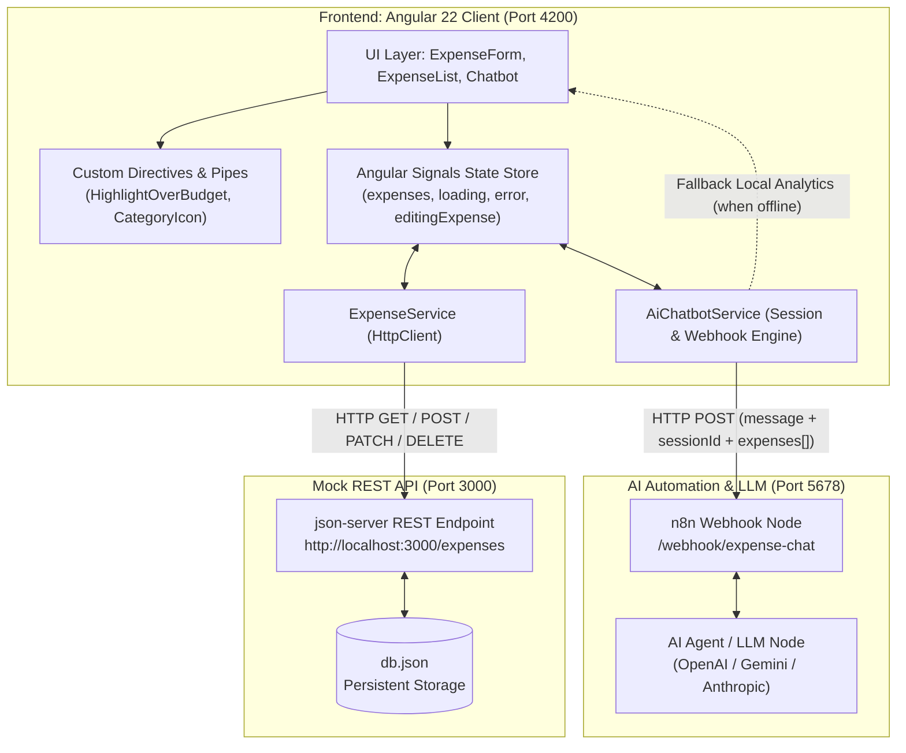
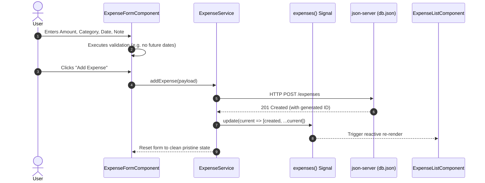
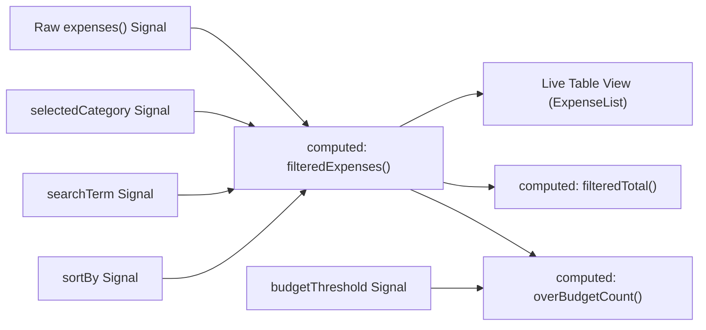
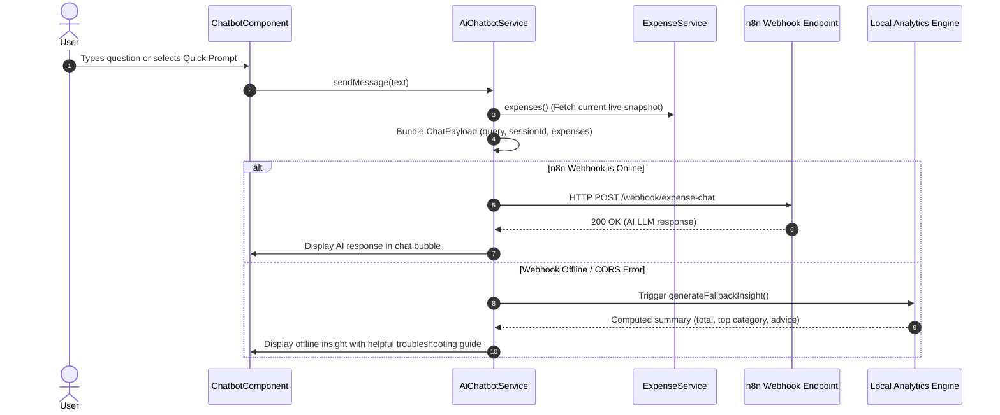

# 💰 ExpenseTracker (AI-Powered)

> **ITI Graduation Project** — A full-featured, modern Personal Finance & Expense Management web application engineered with **Angular 22 (Signals & Standalone Components)**, a simulated **RESTful JSON Backend**, and an intelligent **n8n AI Webhook Assistant** for automated financial insights.

[](https://angular.dev/)
[](https://www.typescriptlang.org/)
[](https://github.com/typicode/json-server)
[](https://n8n.io/)
[](https://vitest.dev/)

---

## 📋 Table of Contents

- [Overview](#-overview)
- [Key Features](#-key-features)
- [System Architecture](#-system-architecture)
- [Application Workflow](#-application-workflow)
  - [1. Expense CRUD & State Management Lifecycle](#1-expense-crud--state-management-lifecycle)
  - [2. Real-Time Signal Filtering & Metrics Calculation](#2-real-time-signal-filtering--metrics-calculation)
  - [3. AI Chatbot & n8n Webhook Intelligence Flow](#3-ai-chatbot--n8n-webhook-intelligence-flow)
- [Project Directory Structure](#-project-directory-structure)
- [Data Models & API Contracts](#-data-models--api-contracts)
- [Prerequisites](#-prerequisites)
- [Getting Started & Local Setup](#-getting-started--local-setup)
- [n8n AI Webhook Setup Guide](#-n8n-ai-webhook-setup-guide)
- [Running Unit Tests](#-running-unit-tests)
- [Graduation Project Information](#-graduation-project-information)

---

## 🌟 Overview

**ExpenseTracker** delivers a seamless financial tracking experience combined with AI-driven analytics. Users can record, categorize, edit, filter, and monitor their expenditures in real time with immediate budget alerts.

The application leverages the latest **Angular 22 Signals paradigm** for fine-grained reactivity without Zone.js overhead, connects to a local RESTful JSON server, and features an integrated AI assistant powered by an **n8n workflow webhook** that receives real-time context of the user's spending habits.

---

## ✨ Key Features

- **⚡ Modern Angular 22 Signals Architecture:**
  - Uses reactive `signal()`, `computed()`, and `effect()` for transparent, glitch-free state synchronization.
  - Zero boilerplate standalone components, avoiding legacy `NgModule` declarations.
- **📝 Reactive Forms with Custom Validation:**
  - Robust expense input form with strict validation (required fields, positive monetary values).
  - Custom validator `noFutureDateValidator` ensuring transactions cannot be posted with future timestamps.
  - Smooth bi-directional edit mode synchronized with form controls via signals.
- **🔍 Real-Time Search, Filtering & Sorting:**
  - Instant text-based searching through notes and categories.
  - Category filtering (`Food`, `Transport`, `Shopping`, `Bills`, `Entertainment`, `Other`).
  - Multi-criteria sorting (Date ascending/descending, Amount ascending/descending).
- **⚠️ Dynamic Over-Budget Highlighting:**
  - Custom attribute directive `[appHighlightOverBudget]` that monitors spending amounts against an interactive threshold.
  - Dynamically highlights expenses exceeding the limit with custom visual cues and warning tooltips.
- **🎨 Pipes & UI Micro-Interactions:**
  - `CategoryIconPipe` maps categories to distinct visual emojis.
  - Status indicator tracking live backend connectivity (`json-server Connected` vs. `Backend Disconnected`).
- **🤖 Context-Aware AI Chatbot Assistant:**
  - Embedded floating assistant widget with quick-query suggestions.
  - Dispatches queries alongside the complete active snapshot of tracked expenses to an **n8n Webhook**.
  - Built-in **intelligent local fallback analytics engine** that calculates totals, category summaries, and insights even if n8n is offline or unreachable.

---

## 🏛️ System Architecture



---

## 🔄 Application Workflow

The application operates across three core operational workflows:

### 1. Expense CRUD & State Management Lifecycle



1. **Input & Validation**: User inputs expense details into the `ExpenseFormComponent`. The reactive form validates non-negative amounts, required fields, and validates against future dates (`noFutureDateValidator`).
2. **Dispatch**: Upon submit, `ExpenseService.addExpense()` issues a `POST` request to `http://localhost:3000/expenses`.
3. **Reactive Store Update**: Once created, the service updates `expenses.update(...)`, inserting the item at the top of the collection.
4. **View Synchronization**: Components consuming the `expenses()` signal automatically reflect changes with zero manual refresh.
5. **Editing Cycle**: Clicking "Edit" sets `editingExpense` signal. An `effect()` automatically patches the form controls and activates the "Update Expense" state.
6. **Deletion Cycle**: Clicking "Delete" prompts user confirmation, sends an HTTP `DELETE`, and filters the item out of the local signal.

---

### 2. Real-Time Signal Filtering & Metrics Calculation



- When the user modifies the search text, switches category tabs, adjusts sorting, or changes the budget threshold:
  - No new HTTP request is triggered.
  - The `filteredExpenses` computed signal re-evaluates in memory instantly.
  - The `filteredTotal` signal computes total spending for the active view.
  - The `overBudgetCount` signal computes how many items breach the configured monetary limit.
  - The `[appHighlightOverBudget]` directive updates visual styles on matching rows.

---

### 3. AI Chatbot & n8n Webhook Intelligence Flow



- **Session Continuity**: Generates and persists a unique `sessionId` in `sessionStorage`.
- **Payload Composition**: Each request sends:
  ```json
  {
    "message": "Summarize my spending on Food",
    "sessionId": "session_abc123_1726000000",
    "expenses": [
      { "id": "1", "amount": 24.5, "category": "Food", "date": "2026-03-10", "note": "Lunch" }
    ]
  }
  ```
- **Resilient Fallback**: If n8n is offline or unreachable, the local analytics engine analyzes the current expense array directly in the browser and produces a breakdown (e.g. highest category, total expenditure, and suggestions).

---

## 📁 Project Directory Structure

```text
d:\ITIGraduation\
├── angular.json                     # Angular CLI project configuration
├── db.json                          # JSON database for json-server
├── package.json                     # NPM dependencies & operational scripts
├── tsconfig.json                    # Base TypeScript compiler configuration
├── public/                          # Static public assets
└── src/
    ├── main.ts                      # Application bootstrap entry point
    ├── index.html                   # Root HTML template
    ├── styles.css                   # Global styles & design tokens
    ├── environments/
    │   ├── environment.ts           # Development environment config (API & Webhook URLs)
    │   └── environment.development.ts
    └── app/
        ├── app.component.ts         # Main root standalone component
        ├── app.component.html       # Primary application layout & header
        ├── app.component.css        # Root responsive layout styles
        ├── app.config.ts            # Application providers (HttpClient, Routing)
        │
        ├── models/                  # Type definitions & interfaces
        │   ├── expense.model.ts     # Expense, ExpenseCategory, SortOption models
        │   └── chat.model.ts        # ChatMessage, ChatPayload, ChatResponse models
        │
        ├── services/                # Angular Singleton Services
        │   ├── expense.service.ts   # Signals-based REST client for expenses
        │   └── ai-chatbot.service.ts# Chat session & n8n webhook communication service
        │
        ├── components/              # Standalone UI components
        │   ├── expense-form/        # Reactive form with custom date validator
        │   │   ├── expense-form.component.ts
        │   │   ├── expense-form.component.html
        │   │   └── expense-form.component.css
        │   ├── expense-list/        # Filterable, sortable table & metrics display
        │   │   ├── expense-list.component.ts
        │   │   ├── expense-list.component.html
        │   │   └── expense-list.component.css
        │   └── chatbot/             # Floating AI chatbot drawer & prompts
        │       ├── chatbot.component.ts
        │       ├── chatbot.component.html
        │       └── chatbot.component.css
        │
        ├── directives/              # Custom Directives
        │   └── highlight-over-budget.directive.ts # Over-budget visual indicator
        │
        └── pipes/                   # Custom Pipes
            └── category-icon.pipe.ts # Maps category strings to emoji icons
```

---

## 📑 Data Models & API Contracts

### Expense Entity (`expense.model.ts`)

| Field | Type | Description |
|---|---|---|
| `id` | `string` | Unique identifier (generated by json-server) |
| `amount` | `number` | Numeric monetary amount (min: 0.01) |
| `category` | `'Food' \| 'Transport' \| 'Shopping' \| 'Bills' \| 'Entertainment' \| 'Other'` | Fixed expense category enum |
| `date` | `string` | ISO Date string (`YYYY-MM-DD`, cannot be in the future) |
| `note` | `string` | Optional description or context (max: 150 chars) |

### AI Webhook Contract (`chat.model.ts`)

**Request Payload (`POST /webhook/expense-chat`):**
```json
{
  "message": "Which category has the highest spending?",
  "sessionId": "session_8f39a0_1726000000000",
  "expenses": [
    {
      "id": "1",
      "amount": 24.5,
      "category": "Food",
      "date": "2026-03-10",
      "note": "Lunch at Italian Bistro"
    }
  ]
}
```

**Expected Response:**
```json
{
  "reply": "Your highest spending category is Food with a total of $140.00 across 2 transactions."
}
```
*(Supports variations like `{ "output": "..." }`, `{ "message": "..." }`, or raw text).*

---

## ⚙️ Prerequisites

Before running the application, make sure you have installed:

- **[Node.js](https://nodejs.org/)** (v18.19.0 or higher recommended)
- **[npm](https://www.npmjs.com/)** (v9.0.0 or higher)
- **[Angular CLI](https://angular.dev/tools/cli)** (v22.x or run via `npx ng`)

---

## 🚀 Getting Started & Local Setup

### 1. Clone the Repository

```bash
git clone https://github.com/ahmedelbahgy22/ITI-Graduation-Project.git
cd ITI-Graduation-Project
```

### 2. Install Dependencies

```bash
npm install
```

### 3. Launch the Mock REST Server

Run the `json-server` backend to serve `db.json` on port 3000:

```bash
npm run server
```
> The API will be reachable at: `http://localhost:3000/expenses`

### 4. Launch the Angular Application

In a separate terminal window, start the Angular development server:

```bash
npm start
```
> Navigate to `http://localhost:4200/` in your web browser.

---

## ⚡ n8n AI Webhook Setup Guide

To enable the live AI reasoning engine in the floating chatbot:

1. Install and start [n8n](https://n8n.io/) locally:
   ```bash
   npx n8n
   ```
2. Open `http://localhost:5678` in your browser.
3. Create a new workflow with a **Webhook Node**:
   - **HTTP Method**: `POST`
   - **Path**: `expense-chat`
   - **Response Mode**: `When Last Node Finishes` (or `Using 'Respond to Webhook' Node`)
4. Connect an **AI Agent / LLM Node** (e.g. OpenAI GPT-4o, Google Gemini, or Ollama):
   - **System Message**: `"You are a personal financial advisor. You receive a JSON array of expenses and a user message. Provide concise, friendly, and analytical advice."`
5. Connect a **Respond to Webhook** node returning:
   ```json
   {
     "reply": "={{ $json.output }}"
   }
   ```
6. **Activate** the workflow and verify the webhook URL matches `src/environments/environment.ts`:
   ```typescript
   n8nWebhookUrl: 'http://localhost:5678/webhook/expense-chat'
   ```

*(If n8n is not running, the chatbot will seamlessly switch to its integrated local analytics mode).*

---

## 🧪 Running Unit Tests

To execute the unit test suites using the **Vitest** test runner:

```bash
npm test
```

---

## 🎓 Graduation Project Information

- **Institution:** Information Technology Institute (ITI)
- **Project Title:** ExpenseTracker — AI-Powered Personal Finance Platform
- **Developer:** [Ahmed Elbahgy](https://github.com/ahmedelbahgy22)
- **Framework & Version:** Angular 22, TypeScript 6
- **Architecture Style:** Component-driven, Signal-based Reactive Store, Headless REST Backend
